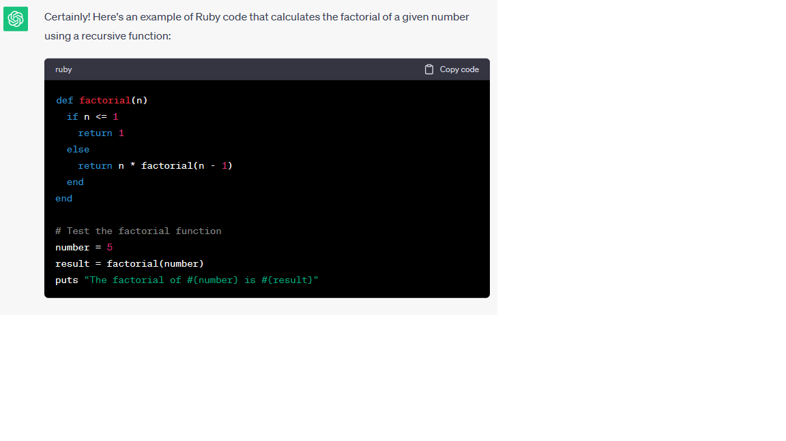

# Wrtiting Good Documentation

## Step 1 - Using Codeblocks.

Codeblocks in markdown make it *very easy* for tech people to **copy, paste, and share** code. 
A good __Cloud Engineer__ uses Codeblocks whenever possible.

Because it allows others to copy and paste their code to replicate or research issues.


- In order to create codeblocks in markdown you need to use three backticks (`)
- Not to be confused with quotation (')
  
```
class Person
  # Constructor
  def initialize(name = "Unknown")
    @name = name  # instance variable
  end

  # Setter method for name
  def name=(name)
    @name = name
  end

  # Getter method for name
  def name
    @name
  end

  # Method to greet the person
  def greet
    puts "Hello, #{@name}!"
  end
end

```

- When you can you should attempt to apply syntax highlighting to your codeblocks.

  ```ruby
  class Person
  # Constructor
  def initialize(name = "Unknown")
    @name = name  # instance variable
  end

  # Setter method for name
  def name=(name)
    @name = name
  end

  # Getter method for name
  def name
    @name
  end

  # Method to greet the person
  def greet
    puts "Hello, #{@name}!"
  end
  
  ```


Good Cloud Engineers use codeblocks for both Code and Errors that appear in the console.

```bash
NameError: undefined local variable or method `some_undefined_variable' for main:Object
```
> Here is an example of using a codeblock for an error that appears in bash.

When you can always provide a codeblock instead of a screenshot.
If you need to take a screenshot make sure it is not a photo from your phone.

> There are certain cases where it's okay to take photos with your phone. This is when you are showing a keyboard, which does not appear on a computer screen.
If it renders on your computer screen it should be a screenshot.


## Step 2 - Hot to take screenshots 

A screenshot is when you capture a part of your screen from your laptop, desktop, or phone.

This is not be confused with taking a photo with your phone.

**Don't do This**


This is what a screenshot from your computer should look like

**Do This Instead**




Taking screenshots on both macOS and Windows is straightforward and can be done using hotkeys. Here are instructions for both operating systems:

**Windows Hotkeys:**

1. **PrtScn (Print Screen) Key:**
   - Press the `PrtScn` key to capture the entire screen. The screenshot will be copied to the clipboard.
   - To capture only the active window, press `Alt + PrtScn`. This will also copy the screenshot to the clipboard.

2. **Windows + Shift + S (Windows 10 and later):**
   - Press `Win + Shift + S` to open the Snip & Sketch tool, which allows you to select an area to capture. The screenshot is copied to the clipboard.

3. **Windows + PrtScn (Windows 8 and later):**
   - Press `Win + PrtScn` to capture the entire screen and save the screenshot as an image file in your "Screenshots" folder within your "Pictures" library.

4. **Windows + Alt + PrtScn (Windows 10 and later):**
   - Press `Win + Alt + PrtScn` to capture the active window and save it as an image file in your "Screenshots" folder.

**macOS Hotkeys:**

1. **Shift + Command + 3:**
   - Press `Shift + Command + 3` to capture the entire screen. The screenshot will be saved as a file on your desktop by default.

2. **Shift + Command + 4:**
   - Press `Shift + Command + 4` to capture a selected portion of the screen. After pressing this shortcut, you can drag to select the area you want to capture. The screenshot will be saved as a file on your desktop.

3. **Shift + Command + 4, then Spacebar:**
   - Press `Shift + Command + 4` and then press the `Spacebar` key to capture a specific window or dialog box. Click on the window you want to capture, and the screenshot will be saved as a file on your desktop.

4. **Control + Shift + Command + 3:**
   - Press `Control + Shift + Command + 3` to capture the entire screen and copy it to the clipboard.

5. **Control + Shift + Command + 4:**
   - Press `Control + Shift + Command + 4` to capture a selected portion of the screen and copy it to the clipboard.

6. **Control + Shift + Command + 4, then Spacebar:**
   - Press `Control + Shift + Command + 4` and then press the `Spacebar` key to capture a specific window or dialog box and copy it to the clipboard.

These hotkeys make it easy to capture screenshots on both Windows and macOS, and you can choose the method that best suits your needs.


## Step 3 - Use GitHub Flavored Markdown Task Lists

GitHub extends Markdown to have a list where you can check off items. [<sup> [1] <sup>](#external-references)

- [x] Finish Step 1
- [] Finish Step 2
- [x] Finish Step 3

## Step 4 Use Emojis (Optional)

GitHub Flavored Markdown (GFM) Supports emoji shortcodes. Here are some examples:

| Name | Short | Emoji |
| --- | --- | ---|
| Cloud | `:cloud:` | :cloud: |
| Cloud with lighting | :cloud_with_lightning | 🌩️ |

## Step 5 - how to create a table

You can use the following format to create tables:

```md
| Name | Short | Emoji |
| --- | --- | ---|
| Cloud | `:cloud:` | :cloud: |
| Cloud with lighting | :cloud_with_lightning | 🌩️ |
```
GitHub extends the functionality of Markdown tables to provide more alignment and table cell formatting options.
[<sup> [2] <sup>](#external-references)


[secret window Hidden Garden](secret-window/hidden-garden.md)

## External References 

- [GitHub Flavored Markdown Spec](https://docs.github.com/en/get-started/writing-on-github/getting-started-with-writing-and-formatting-on-github/basic-writing-and-formatting-syntax#quoting-text) 

- [GitHub Flavored Markdown Spec](https://docs.github.com/en/get-started/writing-on-github/getting-started-with-writing-and-formatting-on-github/basic-writing-and-formatting-syntax)

- [GFM - Task Lists](https://docs.github.com/en/get-started/writing-on-github/getting-started-with-writing-and-formatting-on-github/basic-writing-and-formatting-syntax#lists) <sup> [1] <sup>

- [GFM - Emoji CheatSheet](https://github.com/ikatyang/emoji-cheat-sheet)

- [GFM - Tables (with extensions)](https://github.github.com/gfm/#tables-extension-) <sup> [2] <sup>


